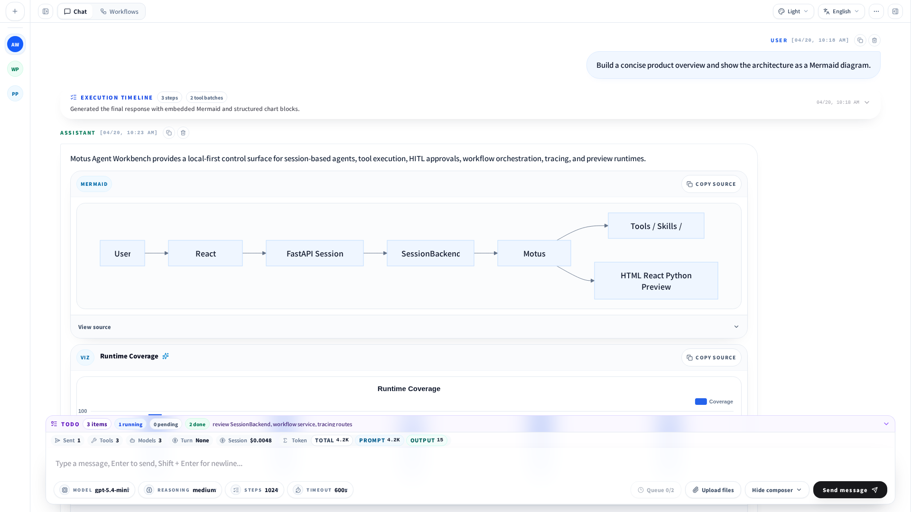
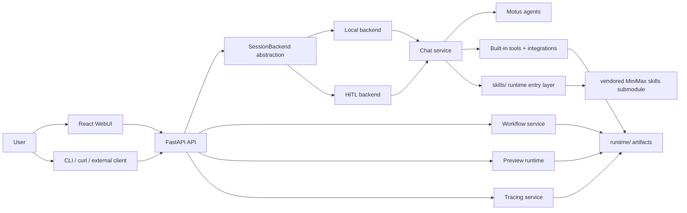

# Motus Agent Workbench

[](LICENSE)
[](https://www.python.org/)
[](web/)
[](apps/server.py)

English | [简体中文](README.zh-CN.md)

Motus Agent Workbench is a local-first agent project built on top of the Motus SDK. It combines a unified Python backend, session-oriented HITL flows, tool and skill runtime hosting, workflow orchestration, tracing, code preview runtimes, and a production-oriented React WebUI.

The goal is not to ship another chat wrapper. The goal is to consolidate **sessions, tool execution, approvals, tracing, preview, and visualization** into one reusable local agent architecture that can keep evolving into desktop, Tauri, or other UI surfaces.

## Highlights

- Session-first architecture with per-session config, history, title generation, usage, cost, and runtime state.
- Unified backend abstraction for both local and HITL session execution.
- HITL support for interrupts, resume flows, tool approval, question answering, and live telemetry.
- Workflow registry, planner, execution, cancel/terminate control, and tracing integration.
- Built-in HTML / React / Python preview runtime with Python terminal output.
- Embedded visualization support for Mermaid, structured charts, and data-analysis oriented blocks.
- React WebUI covering chat, workflow, tracing, runtime catalog, preview dock, themes, and i18n.

## Screenshot



## Architecture



## Tech Stack

- Backend: Python 3.14, FastAPI, Motus SDK, `uv`
- Frontend: React 19, TypeScript, Vite, TanStack Query, Tailwind CSS 4
- Testing: pytest, Vitest, Playwright
- Visualization and rendering: Mermaid, ECharts, highlight.js, xterm

## Repository Layout

```text
apps/                  Entrypoints
core/                  Backend runtime implementation
core/backends/         Shared session backend abstraction
core/chat/             Sessions, history, titles, turn flow
core/preview/          HTML / React / Python preview runtime
core/servers/          FastAPI and HITL servers
core/schemas/          Shared schemas for backend and frontend
core/workflows/        Workflow registry, execution, persistence
docs/                  Architecture notes, plans, smoke results
scripts/smoke/         End-to-end and system smoke scripts
skills/                Runtime skill entry layer
tests/                 Python tests
tools/integrations/    Tool implementations and integrations
vendor/minimax-skills/ Third-party skills submodule
web/                   React WebUI
runtime/               Local runtime artifacts, not committed
```

Additional docs:

- [`docs/项目结构梳理.md`](docs/%E9%A1%B9%E7%9B%AE%E7%BB%93%E6%9E%84%E6%A2%B3%E7%90%86.md)
- [`docs/开发文档.md`](docs/%E5%BC%80%E5%8F%91%E6%96%87%E6%A1%A3.md)
- [`docs/前端接入说明.md`](docs/%E5%89%8D%E7%AB%AF%E6%8E%A5%E5%85%A5%E8%AF%B4%E6%98%8E.md)

## Quick Start

### 1. Clone the repository

Clone with submodules from the beginning:

```bash
git clone --recurse-submodules <repo-url>
cd motus_ui
```

If you already cloned the repository, initialize submodules once:

```bash
git submodule update --init --recursive
```

### 2. Prepare environment variables

```bash
cp .env.example .env
```

Common variables:

- `OPENAI_API_KEY`
- `OPENAI_BASE_URL`
- `FIRECRAWL_KEY` or `FIRECRAWL_API_KEY`
- `APP_BACKEND_MODE`
- `MOTUS_TRACING_*`

Keep real secrets in the local `.env` file only.

### 3. Install dependencies

```bash
uv sync
cd web
npm install
cd ..
```

### 4. Start the backend

```bash
uv run agent-server
```

Optional entrypoints:

```bash
uv run agent-hitl-server
uv run agent-tui
```

Typical local endpoints:

- API: `http://127.0.0.1:8000/api`
- WebUI: usually `http://127.0.0.1:5173`

### 5. Start the WebUI

```bash
cd web
npm run dev
```

## Common Commands

Backend:

```bash
uv run pytest
uv run python -m py_compile apps/*.py core/**/*.py tools/**/*.py scripts/**/*.py
uv run python -m scripts.smoke.run_all
```

Frontend:

```bash
cd web
npm run build
npm run test
npm run e2e
npm run lint
```

## Minimal API Example

Create a session:

```bash
curl -s http://127.0.0.1:8000/api/sessions \
  -H 'Content-Type: application/json' \
  -d '{"system_prompt":"You are a reliable assistant.","model_name":"gpt-4o"}'
```

Send a message:

```bash
curl -s http://127.0.0.1:8000/api/sessions/<session_id>/messages \
  -H 'Content-Type: application/json' \
  -d '{"content":"Summarize this project in one sentence."}'
```

Stream a turn:

```bash
curl -N http://127.0.0.1:8000/api/sessions/<session_id>/messages/stream \
  -H 'Content-Type: application/json' \
  -d '{"content":"Use tools first, then summarize the result."}'
```

## Repository Conventions

- `runtime/`, `release/`, `.venv/`, `node_modules/`, `web/dist/`, coverage output, and test-results are not committed.
- Session logs, traces, uploads, preview artifacts, and debug screenshots should be treated as sensitive data.
- `skills/` is the runtime skill entry layer, while `tools/integrations/` contains concrete implementation code.
- `vendor/minimax-skills/` is intentionally kept as a Git submodule to preserve upstream history and license boundaries.

## Documentation

- [`AGENTS.md`](AGENTS.md): contributor and coding conventions
- [`CONTRIBUTING.md`](CONTRIBUTING.md): contribution process
- [`SECURITY.md`](SECURITY.md): security policy
- [`docs/runtime-requirements.md`](docs/runtime-requirements.md): runtime requirements for tools, MCP, and skills
- [`docs/open-source-release-checklist.md`](docs/open-source-release-checklist.md): release checklist
- [`docs/open-source-audit.md`](docs/open-source-audit.md): repository open-source audit

## License

This repository is licensed under **Apache License 2.0** (`Apache-2.0`).

The root repository follows Apache-2.0 to stay aligned with the current Motus ecosystem licensing direction and to keep reuse, modification, and redistribution straightforward for both individual and enterprise use.

Notes:

- The root repository source code and documentation are covered by the Apache-2.0 terms in [`LICENSE`](LICENSE).
- `vendor/minimax-skills/` is an upstream third-party submodule and keeps its own history and licensing context.
