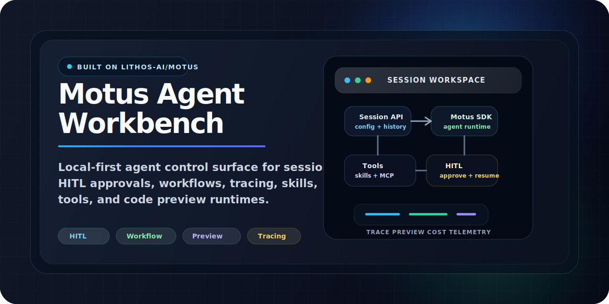
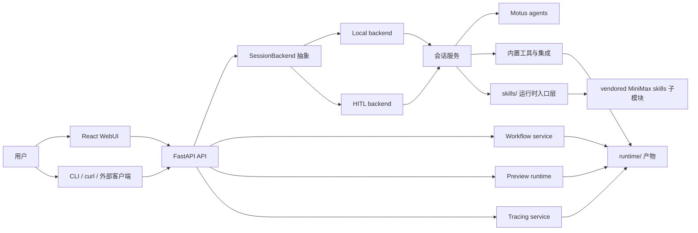

# Motus Agent Workbench

[English](README.md) | 简体中文

Motus Agent Workbench 是一个基于 Motus SDK 的本地 Agent 工作台，包含统一 Python 后端、会话级 HITL 链路、工具与 skill 运行时、Workflow 编排、追踪、代码预览运行时，以及面向日常使用的 React WebUI。

它的目标不是只做一个聊天界面，而是把 **会话、工具调用、审批、追踪、预览和可视化** 收敛到一套可复用的本地 Agent 架构中，方便后续继续接桌面端、Tauri 或其他 UI 形态。



## Navigation

- [Core Capabilities](#core-capabilities) 快速了解项目能做什么。
- [Architecture](#architecture) 查看整体运行结构。
- [Quick Start](#quick-start) 用最短路径启动项目。
- [Who Is This For](#who-is-this-for) 判断这个项目是否适合你的团队。
- [Roadmap](#roadmap) 查看下一阶段重点方向。

## Core Capabilities

- Session-first 架构：每个会话有独立配置、历史、标题、usage、cost 和状态机。
- 统一 backend 抽象：同时支持 local backend 和 HITL backend。
- HITL：支持 interrupt、resume、工具审批、问题回填和运行中 telemetry。
- Workflow：支持注册、规划、执行、取消、终止和 tracing。
- 代码预览：支持 HTML / React / Python 快速预览与 Python 终端输出。
- 可视化增强：支持 Mermaid、结构化图表和数据分析图表块。
- WebUI：覆盖会话、工作流、追踪、运行时目录、预览窗口、主题和 i18n。

## Architecture



## Quick Start

### 1. 克隆仓库

建议从一开始就带上 submodule：

```bash
git clone --recurse-submodules <repo-url>
cd motus_ui
```

如果已经拉下仓库，再补一次：

```bash
git submodule update --init --recursive
```

### 2. 准备环境变量

```bash
cp .env.example .env
```

常用变量：

- `OPENAI_API_KEY`
- `OPENAI_BASE_URL`
- `FIRECRAWL_KEY` 或 `FIRECRAWL_API_KEY`
- `APP_BACKEND_MODE`
- `MOTUS_TRACING_*`

真实密钥只保留在本地 `.env`。

### 3. 安装依赖

```bash
uv sync
cd web
npm install
cd ..
```

### 4. 启动后端

```bash
uv run agent-server
```

可选入口：

```bash
uv run agent-hitl-server
uv run agent-tui
```

### 5. 启动 WebUI

```bash
cd web
npm run dev
```

## Common Commands

后端：

```bash
uv run pytest
uv run python -m py_compile apps/*.py core/**/*.py tools/**/*.py scripts/**/*.py
uv run python -m scripts.smoke.run_all
```

前端：

```bash
cd web
npm run build
npm run test
npm run e2e
npm run lint
```

## Who Is This For

- 想做本地优先 Agent 应用，并且需要真实会话状态、工具调用和多轮上下文的开发者。
- 需要审批、打断恢复和人在回路能力的团队或产品原型。
- 希望把 Workflow、Preview、Tracing、Visualization 放在同一套工程里推进的应用 AI 团队。
- 不想拼凑多套 demo，而是想直接基于一套 Python 后端 + React WebUI 持续演进的开发者。

## Roadmap

- 围绕现有后端与 WebUI 分离结构，继续为未来 Tauri 桌面分发做收口。
- 持续压缩大文件与页面级状态耦合，降低维护成本。
- 把 runtime catalog、workflow control、多代理能力进一步产品化到 UI 层。
- 增强视觉回归、smoke test 和开源发布流程。

## 仓库约定

- `runtime/`、`release/`、`.venv/`、`node_modules/`、`web/dist/`、coverage 和 test-results 不入库。
- 会话日志、trace、上传文件、预览产物和调试截图默认视为敏感数据。
- `skills/` 是运行时入口层，`tools/integrations/` 是具体实现层。
- `vendor/minimax-skills/` 使用 Git submodule 保留上游历史和许可证边界。

## 文档入口

- `AGENTS.md`
- `CONTRIBUTING.md`
- `SECURITY.md`
- `docs/project-structure.md`
- `docs/development-guide.md`
- `docs/frontend-integration-guide.md`
- `docs/runtime-requirements.md`
- `docs/open-source-release-checklist.md`
- `docs/open-source-audit.md`

## 许可证

本仓库使用 **Apache License 2.0**，即 **Apache-2.0**。

- 根仓库源码和文档适用 [`LICENSE`](LICENSE) 中的 Apache-2.0 条款。
- `vendor/minimax-skills/` 是第三方上游子模块，保留其自身历史与许可证上下文。
