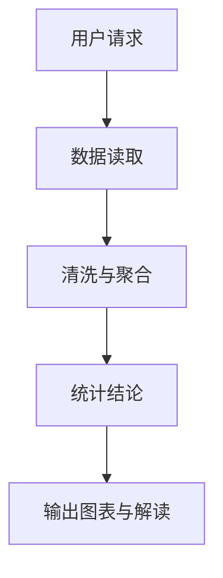
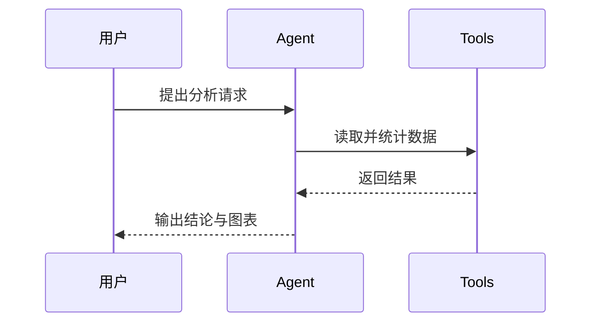
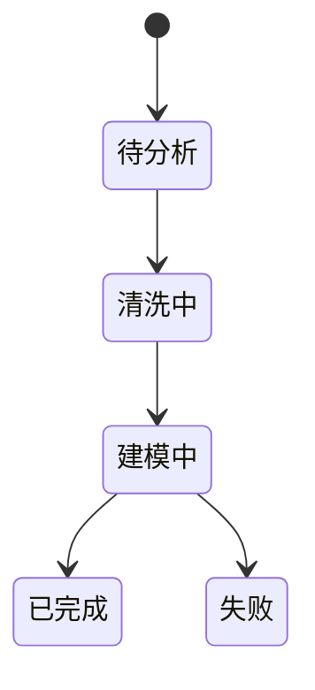
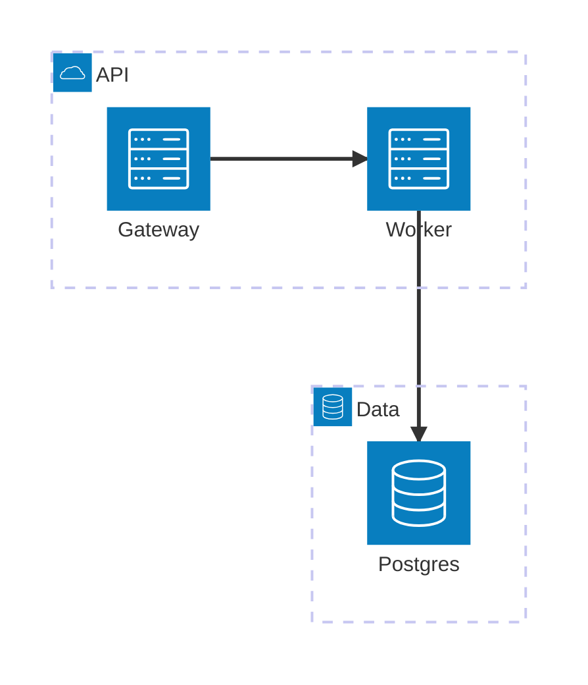
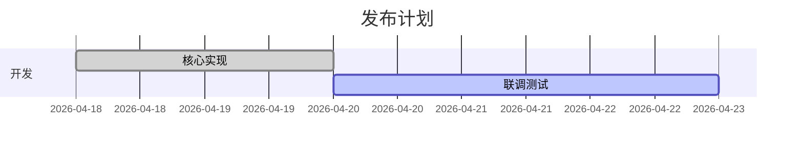
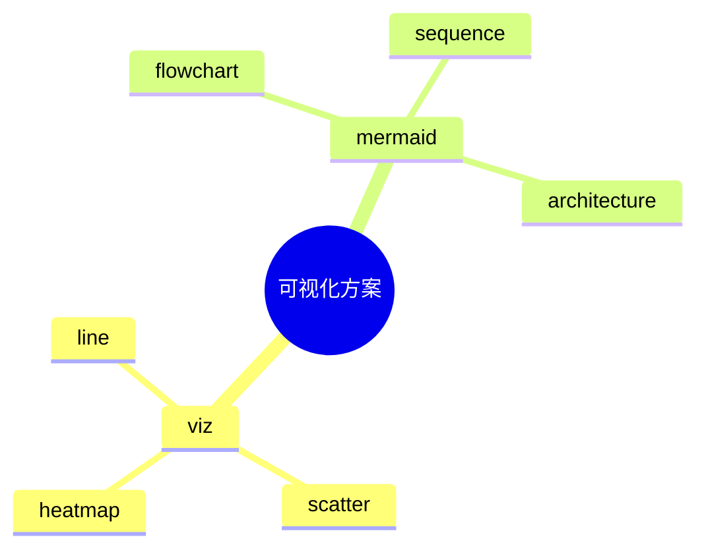
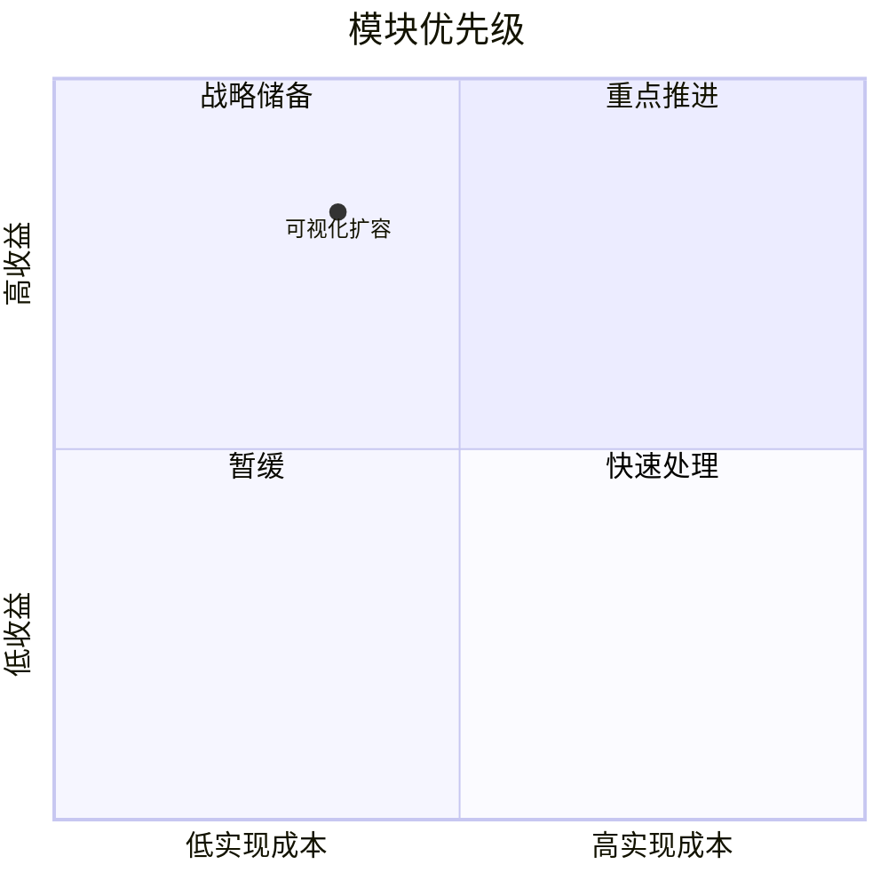

# inline_visualization reference

## Suggested Tools

- load_skill
- bash
- read_file
- glob_search
- grep_search
- to_do

## 何时使用哪种可视化

- 用 `viz`
  - 趋势
  - 对比
  - 占比
  - 分布概览
  - 相关性
  - 转化漏斗
  - 指标评分
  - 流向分析
  - 时段热度
  - 金融 OHLC
  - 数据分析结论
- 用 `mermaid`
  - 流程
  - 状态
  - 架构关系
  - 时序
  - 排查路径
  - 决策分支
  - 算法步骤
  - 模块分层
  - 服务依赖
  - 项目排期
  - 知识结构

## Python 的定位

- Python 主要用于：
  - 读取和清洗 CSV / JSON / TSV / 日志
  - 聚合统计
  - 计算同比、环比、占比、均值、中位数、分位数
  - 生成最终 `viz` 所需的数组和数值
- Python 不应直接成为最终聊天图表的渲染格式
- 默认优先标准库：
  - `csv`
  - `json`
  - `statistics`
  - `collections`
  - `math`
  - `datetime`
- 只有在环境已确认可用时，才使用 `pandas`

推荐套路：

1. 先用 Python 算出干净结果
2. 再把结果改写成合法 `viz` JSON
3. 最终回答中嵌入 `viz` 代码块

## `viz` 合法结构

### 1. 折线图 / 柱状图 / 面积图

必填字段：

- `type`
- `x`
- `series`

合法示例：

```viz
{
  "type": "line",
  "title": "近 7 天调用量",
  "subtitle": "按天统计",
  "x": ["04-12", "04-13", "04-14", "04-15"],
  "xName": "日期",
  "yName": "调用次数",
  "unit": "次",
  "smooth": true,
  "legend": true,
  "series": [
    { "name": "tool_calls", "data": [12, 18, 9, 14] }
  ]
}
```

多序列示例：

```viz
{
  "type": "bar",
  "title": "模型调用对比",
  "x": ["gpt-5.4", "gpt-4o", "gpt-4o-mini"],
  "series": [
    { "name": "成功请求", "data": [32, 19, 44] },
    { "name": "失败请求", "data": [2, 1, 5] }
  ]
}
```

面积图示例：

```viz
{
  "type": "area",
  "title": "累计活跃会话趋势",
  "x": ["周一", "周二", "周三", "周四"],
  "series": [
    { "name": "活跃会话", "data": [20, 28, 35, 41] }
  ]
}
```

### 2. 饼图 / 环形图

合法示例：

```viz
{
  "type": "pie",
  "title": "工具使用占比",
  "series": [
    {
      "data": [
        { "name": "read_file", "value": 18 },
        { "name": "grep_search", "value": 9 },
        { "name": "bash", "value": 5 }
      ]
    }
  ]
}
```

环形图示例：

```viz
{
  "type": "doughnut",
  "title": "工单状态占比",
  "series": [
    {
      "data": [
        { "name": "已完成", "value": 26 },
        { "name": "处理中", "value": 8 },
        { "name": "阻塞", "value": 3 }
      ]
    }
  ]
}
```

### 3. 散点图

```viz
{
  "type": "scatter",
  "title": "延迟与成功率相关性",
  "xName": "延迟(ms)",
  "yName": "成功率",
  "series": [
    {
      "name": "服务 A",
      "points": [
        { "x": 120, "y": 0.91 },
        { "x": 180, "y": 0.86, "label": "峰值时段", "size": 16 }
      ]
    }
  ]
}
```

### 4. 雷达图

```viz
{
  "type": "radar",
  "title": "模型能力对比",
  "indicators": [
    { "name": "准确率", "max": 100 },
    { "name": "速度", "max": 100 },
    { "name": "稳定性", "max": 100 },
    { "name": "成本", "max": 100 }
  ],
  "series": [
    { "name": "gpt-5.4", "data": [92, 78, 88, 60] },
    { "name": "gpt-4o", "data": [87, 85, 80, 72] }
  ]
}
```

### 5. 热力图

```viz
{
  "type": "heatmap",
  "title": "时段活跃热度",
  "x": ["周一", "周二", "周三"],
  "y": ["上午", "下午", "晚上"],
  "values": [
    [0, 0, 12],
    [0, 1, 18],
    [1, 2, 27],
    [2, 1, 16]
  ]
}
```

### 6. 漏斗图

```viz
{
  "type": "funnel",
  "title": "注册转化漏斗",
  "series": [
    {
      "data": [
        { "name": "访问落地页", "value": 1200 },
        { "name": "点击注册", "value": 480 },
        { "name": "提交表单", "value": 260 },
        { "name": "完成激活", "value": 150 }
      ]
    }
  ]
}
```

### 7. 仪表盘

```viz
{
  "type": "gauge",
  "title": "系统健康度",
  "min": 0,
  "max": 100,
  "series": [
    {
      "name": "健康度",
      "value": 82,
      "detail": "{value}%"
    }
  ]
}
```

### 8. 桑基图

```viz
{
  "type": "sankey",
  "title": "用户流向",
  "series": [
    {
      "nodes": [
        { "name": "访问" },
        { "name": "注册" },
        { "name": "下单" },
        { "name": "复购" }
      ],
      "links": [
        { "source": "访问", "target": "注册", "value": 320 },
        { "source": "注册", "target": "下单", "value": 96 },
        { "source": "下单", "target": "复购", "value": 31 }
      ]
    }
  ]
}
```

### 9. K 线图

```viz
{
  "type": "candlestick",
  "title": "价格波动",
  "x": ["04-15", "04-16", "04-17"],
  "series": [
    {
      "data": [
        [102, 108, 98, 112],
        [108, 104, 101, 110],
        [104, 116, 103, 119]
      ]
    }
  ]
}
```

## `viz` 常见错误

- 错误：输出 `data.labels / datasets`
  - 这是 Chart.js 风格，不是当前会话支持的 schema
- 错误：`series[i].data` 长度和 `x` 长度不一致
- 错误：scatter 写成 `data: [[x,y]]`，当前推荐结构是 `points`
- 错误：heatmap 的 `values` 使用真实坐标文本，而不是索引三元组 `[xIndex, yIndex, value]`
- 错误：sankey 的 links 指向了未定义 node
- 错误：写成单引号 JSON
- 错误：在 JSON 里加注释
- 错误：把 Python 列表打印结果和解释文字混进同一个 `viz` 代码块

## Mermaid 推荐模板

### 1. 流程图



### 2. 时序图



### 3. 状态图



### 4. 架构 / 分层图



如果模型对 `architecture-beta` 不稳定，降级成：


### 5. 算法 / 分块图


### 6. 甘特图



### 7. 思维导图



### 8. 象限图



## 推荐输出结构

适合数据分析：

1. 一句话结论
2. 关键图表 `viz`
3. 2 到 4 条解读
4. 如有必要，再补第二张图

适合流程说明：

1. 一句话说明目标
2. `mermaid` 图
3. 2 到 4 条关键节点解释

适合架构或算法说明：

1. 先说系统目标或算法目标
2. 选择 `architecture-beta / block-beta / flowchart / sequenceDiagram`
3. 图后只解释关键路径，不把图里已经写明的内容再重复一遍

## 数据分析场景的简化工作流

当用户提供 CSV / JSON / 日志文件时，优先：

1. 读取样本，确认字段
2. 用 Python 做聚合和统计
3. 只选择最有解释力的图
4. 最终输出：
   - 文本结论
   - `viz` 代码块
   - 简要解读

## 何时不要画图

- 数据点极少，文字一句话就够
- 用户只要一个简短直接答案
- 证据不完整，图会制造误导
- 图表数量会明显干扰阅读
